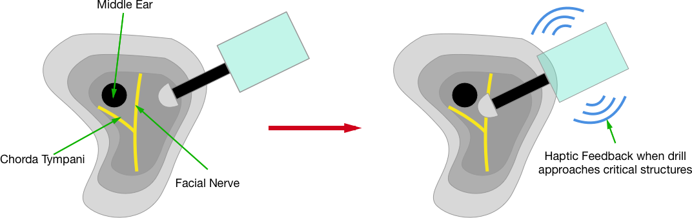
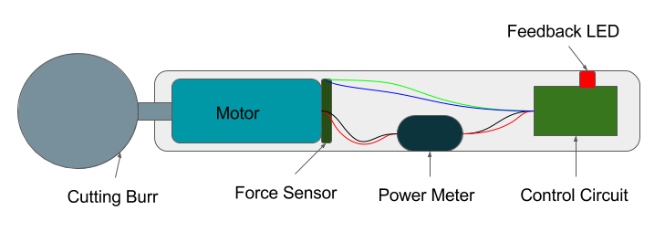
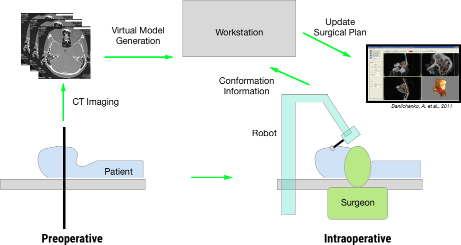
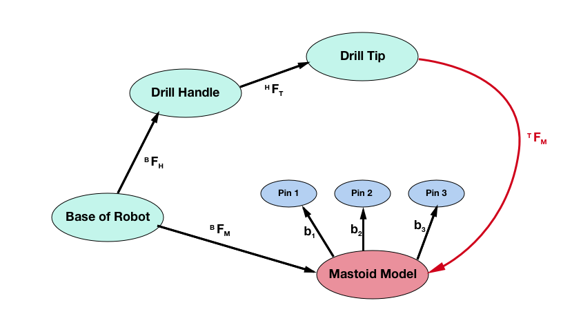

% 600.645 HW1: Mastoid Surgical Procedure Evaluation
% Ravindra Gaddipati, Doran Walsten
% 09/27/2016

# 1. Procedural Analysis

## A. Evaluation Criterion

For the procedure overall, as well as critical steps, we evaluated the following parameters relative to alternative solutions as well as the current standard of care.

- **Cost** 
    + *Definition:* Immediate material costs relative to the entire procedure.
    + *Assessment:* After a mean procedural cost is established, the contribution of the step to the overall cost is used to determine its impact.
    + *Importance:* Material costs impact all stakeholders, reducing the financial burden on the payer (e.g. insurance), hospital, and patient.
- **Resources**
    + *Definition:* Non-material costs, such as increased personnel support or reusable equipment requirements.
    + *Assessment:* Total resource usage is defined to be the number of personnel and the suite of surgical equipment required in the OR during the procedure.
    + *Importance:* With overall reduced resource usage, costs are indirectly reduced having the same impacts as Cost. Additionally, the reduction in resources benefits the hospital in terms of resource allocation and procedural capacity.
- **Safety**
    + *Definition:* Complication rate related to the procedural step.
    + *Assessment:* A higher contribution of the step to the overall complication rate, combined with the severity of the complication, translates to a lower score. Risk to the surgeon, such as radiation, is also included.
    + *Importance:* The primary impact of improving the safety of a step is an improved patient outcome. Surgeon related safety issues are especially important as they are compounded over many procedures.
- **Effectiveness** 
    + *Definition:* How effectively does the step achieve the desired output?
    + *Assessment:* A low score translates to direct objective completion. A high score indicates the step does not fully meet the goals, for example anatomy may prevent direct access.
    + *Importance:* Improving the effectiveness of a procedural step benefits the surgeon as there is reduced risk of failure. The reduced risk translates into better outcomes for the patient and reduced overall costs.
- **Accuracy**
    + *Definition:* Can the step be executed to a close tolerance to the target?
    + *Assessment:* A step might require a higher necessary tolerance due to reduced physical size or an increased risk.
    + *Importance:* The more accurate execution of a step can improve patient outcome and reduce long term complications. Improved accuracy will also reduce the difficulty of the procedure to the surgeon.
- **Time**
    + *Definition:* How long does the step take to execute relate to the overall procedure?
    + *Assessment:* The time is assessed relative to the alternative solutions and base procedure.
    + *Importance:* A long step increases the cost of the procedure, impacting the payer, hospital, and patient. Additionally, reducing the time is beneficial to the surgeon and hospital due to reduced resource usage.

## B. Evaluation

The procedure was broken down into the following steps. The majority of the focus was placed on the Cortical Mastoidectomy, as this procedure is the precursor to many others.

1. Once the surgical site is prepared,an incision is made to expose the temporal bone. The wound is consistently irrigated and maintain visibility while the mastoid air cells are removed. Cutting into the bone begins^1^.

2. As cutting progresses the sigmoid sinus is identified by using a cutting burr to mark the temporal line, a tangential line to the ear canal from the mastoid tip, and finally the line over the sigmoid sinus^9^. This guides further bone removal.

3. The covering of the semicircular canal is typically identified as the bone is a different color than the surrounding bone, also indicating the position of the facial nerve^1^. It is important to prevent damage of the semicircular canal to preserve the patient's sense of balance.

4. Particularly in cochlear implantation or any operations of the middle ear, the facial recess is defined by the facial nerve, chorda tympani and the incus buttress. Exposure allows access to the oval and round window, necessary for the cochlear electrode array.

- Facial nerve paralysis due to damaging the nerve occurs in between 0.6% - 3.6%^4^ of mastoidectomy procedures. If this occurs, the patient will lose their ability to control facial movement. This nerve is sensitive to both mechanical and thermal damage from the drill. It takes experience for the surgeon to identify the correct point at which to stop advancing the drill given the individual patient's anatomy.

5. When a canal wall down procedure is performed, the middle ear is exposed and the posterior osseous ear canal is removed until the facial nerve^8^. During this step it is also important to remove all air cells in the mastoid to minimize the probability of postoperative cavity infections. 

- Once the middle ear is reached, operating within the middle ear itself is challenging. The space is extremely small. For example, when operating on toddlers for cochlear implants, the diameter of the facial recess can be between 1 and 2 mm^7^. This is a very small window to operate on sensitive structure. Consequently, the effectiveness of this procedure is highly dependent on the surgeon's ability to operate in this small space.

6. Always performed after a canal wall down procedure, the procedure removes conchal cartilage and surrounding membranes. This minimizes infection risk and facilitates future cleaning^1^.

The average charge to patient is $72,532 with costs of $20,642, with the majority covered by medicare^5^. Thus, any cost benefit stands to impact insurance and other payers the most.

The procedure itself is technically challenging and it takes an expert surgeon to perform without complication. As discussed above, the significant risks to the patient include facial nerve palsy and damage to the structure of the middle ear. The facial nerve lies beneath the layers of bone obliterated during the mastoidectomy. It also acts as a boundary of the facial recess, which is the path that provides access to the middle ear. This nerve is sensitive to both mechanical and thermal damage from the drill. It takes experience for the surgeon to identify the correct point at which to stop advancing given the individual patient's anatomy.

Once the middle ear is reached, operating within the middle ear itself is challenging. The space is extremely small. For example, when operating on toddlers for cochlear implants, the diameter of the facial recess can be between 1 and 2 mm ^6^. This is a very small window to operate on a sensitive structure. Consequently, the effectiveness of this procedure is highly dependent on the surgeon's ability to operate in this small space.

Currently, the operating time to complete the actual step of mastoidectomy is 15 - 30 minutes. However, operations such as cochlear implants last up to 132 minutes^7^. 

Throughout the procedure, much of the work is focused on (a) the complete removal of mastoid air cells, particularly in cases of infection, and (b) the identification of critical structures. Performing both of these steps effectively ensures correct surgical outcome, and prevention of symptomatic recurrence. Based on the evaluation above, two possible computer assisted techniques are identified to address these issues.

# 2. Identifying alternatives

## A. Guided Surgical Drill
The premise behind this solution is similar to the MAKO Rio robot shown in lecture earlier this semester. One of the biggest challenges in this procedure is avoiding key underlying structures such as the facial nerve and chorda tympani. If the surgeon could receive feedback from the drill as they approach these structures within the patient, injury to these structures could be avoided. In the case of infection air cell removal, the surgeon can get feedback on whether there are still any infected air cells left in the mastoid as he/she is operating. 

Prior to the procedure, the surgeon is able to develop a surgical plan based on the anatomy of the individual patient then execute it accurately with the assistance of a surgical robot. Preoperative CT scans are used to create a reconstruction, and identify the area of bone to remove.

  - The surgeon drills markers into the patient's skull as reference points for later processing
  - The patient gets a CT scan in order to get a model of the temporal bone
  - The surgeon labels the CT slices with the location of the structures to avoid in addition to the planned surgical path to the middle ear
  - Intraoperatively, the tip of the drill is mapped to the virtual model of the patient's temporal bone
  - While the surgeon drills, he/she is able to see progress along the surgical plan (either infection removal or simply a path to the middle ear) as well as receive haptic feedback whenever the drill tip approaches the critical structures to avoid. This feedback will also prevent the surgeon from actually pressing into the protected region.
  - Once the mastoidectomy is complete, the surgeon is able to continue with the rest of the procedure as planned.

\

## B. Tactile feedback for air cell removal

One of the primary goals of mastoidectomies performed in the case of infection is draining and removing as much of the mastoid air cells as possible. This solution focuses on helping the surgeon remove as much of the air cells as possible, while preventing breach of critical structures such as the sigmoid sinus and semicircular canals. Unlike the previous solution, this one is contained in the handtools that the surgeon uses, eliminating the need for external feedback.
The delineation between air cells and the critical structures is similar to the difference between cancellous and cortical bone. By outfitting the cutting burr with force sensors, we can predict when the surgeon is beyond the air cells, or if there are more air cells to be cleared.

\

The device consists of four primary parts:

1. The cutting burr
2. A linear force sensor
3. A power meter on the cutting burr
4. Control system

During operation, the cutting burr is able to take feedback from the power meter to determine the resistance to cutting the bone, with a higher power consumption corresponding to a denser bone with less air cells. With this feedback, an error may be introduced due to varying amounts of force applied by the surgeon. The secondary linear force sensor is used to dynamically adjust the sensitivity of the power meter, reducing the impact of such variances surgeon to surgeon. A simple potential control loop is shown below. Through testing, a more effective but complex control loop could be established.

\

A typical surgeon use case might look like this:

1. After the surgeon exposes the temporal bone, he begins to cut away.
2. Once the surgeon identifies air cells, a button is pressed to indicate air cells are being cut. This is used to establish a baseline as the cuts get deeper and closer to the critical structures.
3. As the cutting continues, the sensing is automatically adjusted as the surgeon adjusts the cutting force he uses.
4. Once the cutting burr reaches denser bone, the surgeon is alerted with a vibrational, auditory, and/or visual feedback.

## C. Comparison

Here, we compare the two alternatives described above to each other as well as the existing method with respect to our evaluation criteria.

### 1. Cost
Because of the addition of a robotic system into the procedure, the cost of the procedure is likely to increase over the existing method. This could be a problem in procedures such as a cochlear implant where the materials needed for the procedure are already expensive. However, if the the alternatives above prevent damage to the critical structures of the ear, additional costs to the patient and hospital could be prevented. This may not be on the scale of the initial investment of the robot for a significant amount of time, but it is still possible.

 Between the two types of robotic systems suggested, the first is likely to be more expensive. This is because of its increased functionality, encompassing that of the second.

### 2. Complications
The entire goal of adding in the computer-assisted system is to reduce the incidence of complications. Assuming that the models created by the systems suggested are accurate, this will be the case. However, there are still other complications of these procedures which are not directly related to how close the surgeon operates to the nerves of interest. These include wound infection, hematoma, and vertigo just to name a few. The first two are risks inherent in many surgical procedures and the latter is often a consequence of working so close to the semicircular canals during any otologic procedure.

To differ between the two alternatives described above, a surgeon may be able to adapt an operating plan better in the first case. If the patient model is imperfect and the surgeon detects that as he/she is operating, they can adjust the operating plan and intervene. The sensing drill may pose some difficulty when used with some patients, such as those with osteopathic bones or those with exceptionally dense bone.

While the navigational system is more complex, it facilitates better preoperative planning and reduces the probability of a intraoperative deviation.

### 3. Effectiveness of the Procedure

With both of the robotic alternatives described, the surgeon is able to generate an operating plan that best fits the patient's anatomy and puts the surgeon in the best position possible effectively perform the procedure. With proper implementation, we believe the navigational solution offers a better visualization to the surgeon, and thus can improve outcomes by ensuring proper planning.

### 4. Operating time

The increased confidence provided by the computer-assisted systems will decrease operating time, at the cost of preoperative planning time. The second proposed system will not significantly alter operating time, as the device fits into the current surgical workflow. In contrast, the navigational systems usage of preoperative planning may better prepare the surgeon in difficult cases, potentially saving on-the-fly surgical plat modifications.

Considering all of these factors, we believe that the preferred alternative of the two is the surgical guide approach. It is still able to benefit the surgeon by improving their accuracy and confidence during the operation while giving them the freedom to be flexible. While the cost and time needed is more than the second, it provides a more absolute surgical plan and as a result, improves patient outcome.

# 3. Preferred embodiment
## A. Description of Surgical System as a whole

The system is composed of two main components: a physical robot with active mechanical linkages as well as a computer workstation. This type of design was chosen for a couple of reasons.

First, having a robot with active linkages permits the surgeon to have greater stability while operating. Any tremors usually present can be dampened with the aid of the robot system.

Second, the active linkages also permits very precise encoding of the location of the drill tip. This allows for precise mapping of the drill tip to its location in the virtual model of the mastoid.

The computer workstation integrates information about the probe's position from the robot and transforms it into the virtual world of the mastoid. This information will be displayed on a computer monitor. The probe is registered into this world by bringing the probe into contact with the markers in the mastoid and calculating the appropriate transformation. Below is a diagram of the entire system. (Diagram inspired by Lecture Notes)

\

### Reference frames

Below is a graphic which illustrates the key transformations and reference frames in the above system.

\

In the diagram, the key reference frames include:

- B = Base of Robot
- H = Burr Handle
- T = Burr Tip
- M = Mastoid Model
 
The key transformations/reference frames in this system parallel that of the systems described in class. The crucial step is to define the registration transformation between the robot reference frame (B) and the mastoid model (M). This is done by bringing the drill tip into contact with the three pins in the mastoid which have a known position in the mastoid model reference frame. This defines 3 vectors which can be used to complete the necessary frame transformation.

During the actual operation, similar to the MAKO surgical robot, the virtual mastoid model on the monitor will display the progress of milling into the predefined operating path. As the surgeon approaches the border of the operating region, the physical robot will resist the surgeon's movements as well as change the highlighting of the model in the monitor to alert the surgeon. This work progresses until the entire mastoidectomy is complete.

One of the concerns in addition to mechanical damage to the facial nerve is thermal damage. As the drill digs into bone, it generates heat which can damage these nerves. The surgeon has to be very careful and irrigate the mastoid cavity with water continuously to both cool the tissue and removed bone dust. Feldmann et al have developed a temperature prediction model for the mastoid bone based on distance from the drill tip^8^. This model can be used intraoperatively to alert the surgeon if temperature at the depth of the facial nerve is reaching a critical level and drilling should be modified. Though further validation of this model needs to be done (published in 2016), this model can definitely be included in the feedback to the surgeon during operation. A potential interesting approach would be to optimize the speed of the drill automatically given the current bone density of the mastoid in the model and the current temperature of the underlying bone (which can be determined via CT imaging^8^).

As there has been development in the space of robot-assisted drilling, no components of the system will need to be invented. Because the surgeon is operating in a very small window of space near the patient's head, the design of existing robots will need to change.

### Information usage

A. Preoperative: Virtual Model of patient's temporal bone

- This model is later used during the operation to define the region where the surgeon operates
- To generate the model, a patient first receives a CT scan of the head.
- Prior to the CT scan, the surgeon will screw in a series of markers into the mastoid region of the brain. These markers are use to border the region to remove as well as provide a means of registering the physical probe's location to its position in the virtual model of the mastoid. This is done by calibrating the probe before the operation officially starts. Danilchenko et al have developed a robot prototype that uses this approach to registration.
- Following the CT scan, the surgeon is able to label the critical structures to avoid (facial nerve) as well as outline the region to remove during the operation.
- The CT scan slices can then be used to generate a 3D model
- As the system becomes used, it may become possible to use machine learning to suggest a path to the surgeon and identify the critical structures automatically.
- This information is then utilized in the actual operating room to perform the procedure.
- Due to the margin in distinguishing air cells and normal bone, old cases can be used to tune the boundaries set for air cell removal in future cases, optimizing removal while minimizing risk.

## B. Procedure

1. As mentioned in the previous section, there are three markers implanted into the patient's skull which are used to calibrate and register the location of the probe tip relative to the virtual model of the mastoid.
2. Once the patient has been prepped and put under anesthesia, the surgeon will complete the registration process by touching the drill tip to each of the three markers on the mastoid bone.
3. As the surgeon begins drilling, the computer monitor will begin to display progress into the surgical plan created by the surgeon.
4. Other members of the operating room staff will continue to serve normal functions as the robotic intervention mainly benefits the surgeon. Depending on the size/clumsiness of the robotic system, a member of the staff may play a more crucial role in surgical irrigation
5. Postoperatively, data gathered during the surgery is stored. As an example, a surgeon may be able to review past procedures to get inspiration for the surgical plan of an upcoming procedure. New patient models can be compared to previous procedures to identify the surgical plan that will lead to the best outcomes.

## C. Implementation

Much of the required technology needed for this type of device has been developed, or is currently in development for use in other surgical areas. The reuse allows for a reduced development timeline, and cost.

The primary technical development to be done lies in accurately identifying mastoid air cells within the temporal bone when creating the 3D reconstruction of the bone. Unlike typical reconstruction where bone is clearly delineated from tissue, the distinction between air cells is a more difficult problem. We estimate this development could take between 2-3 years for a preliminary implementation.

Due to the high risk of the procedure and proximity to the facial nerve, regulatory approval may take an estimated 5-10 years, similar prior examples such as Robodoc and Da Vinci^10^. These developments can be completed with the aid of animal models, such as a sheep used by Danilchenko et al.^7^ This long development time also necessitates significant funding to further development in technical performance as well as usability in the OR. Steps such as pre-market approval (PMA) can be as high as $240,000 in the case no predicate device can be identified^10^. With the introduction of many surgical robots, a faster, lower cost 510(k) pathway is likely.

# Citations
1. "Mastoidectomy." _Medscape_. Jul 28 2015, http://emedicine.medscape.com/article/1890933-overview#a3
2. Greg Artz. "Cochlear Implant Surgery Thomas Jefferson." Online video clip. Youtube. Youtube, Apr 26 2013. https://www.youtube.com/watch?v=I8eHquhr52s
3. Trinidade, A., Page, J.C. & Dornhoffer, J.L. Therapeutic Mastoidectomy in the Management of Noncholesteatomatous Chronic Otitis Media: Literature Review and Cost Analysis. Otolaryngology--head and neck surgery : official journal of American Academy of Otolaryngology-Head and Neck Surgery (2016).at <http://www.ncbi.nlm.nih.gov/pubmed/27484233>
4. Chen, S.C. et al. Fluorescence-assisted visualization of facial nerve during mastoidectomy: A novel technique for preventing iatrogenic facial paralysis. Auris, nasus, larynx 42, 113-118 (2015).
5. HCUP National Inpatient Sample (NIS). Healthcare Cost and Utilization Project (HCUP). 2013. Agency for Healthcare Research and Quality, Rockville, MD. http://www.hcup-us.ahrq.gov/nisoverview.jsp
6. Wang, L., Yang, J., Jiang, C. & Zhang, D. Cochlear implantation surgery in patients with narrow facial recess. _Acta oto-laryngologica_ *133*, 935-8 (2013).
7. Danilchenko, A. et al. Robotic mastoidectomy. Otology & neurotology : official publication of the American Otological Society, American Neurotology Society [and] European Academy of Otology and Neurotology *32*, 11-6 (2011).
8. Feldmann, A. et al. Temperature Prediction Model for Bone Drilling Based on Density Distribution and In Vivo Experiments for Minimally Invasive Robotic Cochlear Implantation. Annals of Biomedical Engineering *44*, 1576-1586 (2016).
9. Cortical Mastoidectomy. (n.d.). Retrieved September 27, 2016, from http://www.i-ball.com.au/medicvision/
10. Haidegger, T., & Rudas, I. J. (n.d.). From Concept to Market:. Human-Computer Interaction: Concepts, Methodologies, Tools, and Applications, 484-522. doi:10.4018/978-1-4666-8789-9.ch022

