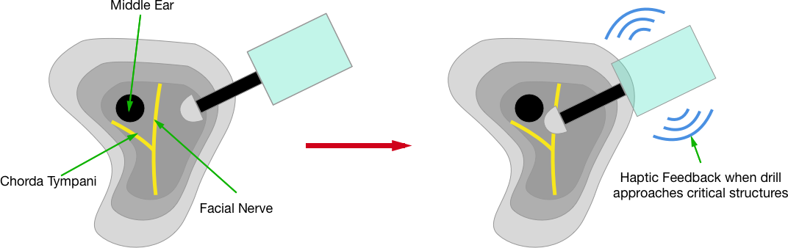

% 600.645 HW1: Mastoidectomy Surgical Procedure Evaluation
% Doran Walsten, collaborating with Ravindra Gaddipati
% 09/18/2016

1. Procedural Analysis
=======================
In this analysis, we review the current state of mastoidectomy procedure. We will identify problem areas with room for improvement.

## A. Evaluation Criterion
Below is a summary of the factors important to consider for this operation.

### 1. Cost

   _Definition_ - This factor includes costs to both the patient as well as the hospital during the process of performing a cochlear implant. We must also consider whether the patient or a health insurance company is the payer for the procedure.   

   _Assessment_ - This will simply be measured in dollars ($). This cost will be considered for the payer (patient/insurance) as well as the hospital.   

   _Relevance_ - The cost of a procedure as well as reimbursement is very important to consider. From the patient perspective, greater costs can disincentivize receiving care. From the hospital's perspective, reimbursement differences between different treatment options can affect the decision on which technique to use. Costs of materials used to operate are also important to consider.  

### 2. Complications

   _Definition_ - Any surgical procedure has the risk of complications which can affect the quality of life of the patient after the procedure.

   _Assessment_ - Complications will be assessed based on frequency (%) and severity. Major complications require additional surgical operation and/or extremely poor quality of life. Minor complications require conservative treatment.

   _Relevance_ - Patient quality of life is important to every stakeholder involved. The risk of complications affects the population of patients that can be safely treated.

### 3. Effectiveness of the Procedure

   _Definition_ - The role of a mastoidectomy is to either remove infected bone tissue or to clear a path to reach the middle/inner ear to treat conditions there.

   _Assessment_ - Recurrence rates (for infection) and either operating time or operation success for procedures which are dependent on the cavity generated by the mastoidectomy.

   _Relevance_ - If the procedure does not lead to the desired outcomes, this becomes a waste to the hospital, surgeon, and patient.

### 4. Operating time

   _Definition_ - This is the amount of time that the actual cochlear implantation procedure takes.

   _Assessment_ - This will be measured in minutes.

   _Relevance_ - Time is money, even in a hospital. The more efficient a surgeon can be in the operating room, the greater the number of procedures he/she is able to perform. In addition, the less amount of time the patient can be under anesthesia, the better for the patient.

## B. Evaluation

   _Steps_ - Summary of the steps of the procedure^1,2^

   - An incision is made behind the ear. The surgeon generates tissue flaps until the temporal bone is exposed
   - A microscope is used as the surgeon begins to drill into the porous mastoid to clear a path to reach the middle ear
   - During the drilling, the surgeon is using constant suction irrigation to both simultaneously clear any bone dust generated by the drill as well as keep the bone cool (prevent thermal damage).
   - This drilling continues until the middle ear is reached via the facial recess, which is a space bounded by the facial nerve and chorda tympani.
   - Once the middle ear is visualized, the surgeon will operate on the middle ear based on the procedure being performed as a whole. As an example, the surgeon would perform a cochleostomy (drill a small hole into the cochlea) if he/she was about to place a cochlear implant.

   - Average operating time of 15 - 30 minutes^3^

   _Complications_ - The following are the main complications of this procedure as well as their cause and impact.

   | Complication | Description | Causes | Rate (if found) |
   | ------------ |------------------------------------------| ------------------- | ---------|
   | Facial Nerve Paralysis | If the facial nerve is damaged, the patient will lose their ability to control facial movement  | Heat generated by drilling, actual drill | 0.6% - 3.6%^4^ |
   |  | |  | |
   | Damage to middle ear| Damage to bones/structures in middle ear could cause permanent hearing loss| Narrow access channel to middle ear, difficult to manipulate instruments | |
   | | |Limited feedback during drilling | |
   |Vertigo/Dizziness| After surgery, the patient fells vertigo and dizziness. Usually short-term minor complication | Common issue with otologic surgery. Can be chronic if drill damages the semicircular canals | Severe issues rare |

It is difficult to assess the cost of just a mastoidectomy as it is often performed as a step within a larger procedure, such as a cochlear implant or cholesteatoma. However, according to HCUP, the average charge to patient is $72,532 with costs of $20,642^5^. Based on some preliminary research, it appears that private insurance/Medicare do cover a significant portion of these costs. Thus, although the cost of these procedures is steep, it is not a significant issue.

The procedure itself is technically challenging and it takes an expert surgeon to perform without complication. As discussed above, the significant risks to the patient include facial nerve palsy and damage to the structure of the middle ear (depending on the operation being performed). The facial nerve lies beneath the layers of bone obliterated during the mastoidectomy. It also acts as a boundary of the facial recess, which is the path that provides access to the middle ear. This nerve is sensitive to both mechanical and thermal damage from the drill. It takes experience for the surgeon to identify the correct point at which to stop advancing given the individual patient's anatomy.

Once the middle ear is reached, operating within the middle ear itself is challenging. The space is extremely small. For example, when operating on toddlers for cochlear implants, the diameter of the facial recess can be between 1 and 2 mm^7^. This is a very small window to operate on sensitive structure. Consequently, the effectiveness of this procedure is highly dependent on the surgeon's ability to operate in this small space.

Currently, the operating time to complete the actual step of mastoidectomy is 15 - 30 minutes. However, operations such as cochlear implants last up to 132 minutes. Although this step may not take a significant amount of time, the design of the cavity can affect the ability of the surgeon to continue the operation.

# 2. Identifying Alternatives

## A. Invisible Guide Surgical Drill

  The premise behind this solution is similar to the MAKO Rio robot shown in lecture earlier this semester. One of the biggest challenges in this procedure is avoiding key underlying structures such as the facial nerve and chorda tympani. If the surgeon could receive feedback from the drill as they approach these structures within the patient, injury to these structures could be avoided. Here is a general description:

  - The surgeon drills markers into the patient's skull as reference points for later processing
  - The patient gets a CT scan in order to get a model of the temporal bone
  - The surgeon labels the CT slices with the location of the structures to avoid in addition to the planned surgical path to the middle ear
  - Intraoperatively, the tip of the drill is mapped to the virtual model of the patient's temporal bone
  - While the surgeon drills, he/she is able to see progress along the surgical plan as well as receive haptic feedback whenever the drill tip approaches the critical structures to avoid. This feedback will also prevent the surgeon from actually pressing into the protected region.
  - Once the mastoidectomy is complete, the surgeon is able to continue with the rest of the procedure as planned.

  \\

## B. Fully Automated Mastoidectomy

  This solution actually takes the entire operation of the mastoidectomy out of the surgeon's hands. As mentioned in the invisible guide alternative, underlying structures can be damaged easily during a mastoidectomy. One approach could be to replace the surgeon entirely by a robotic system which is able to accurately perform the mastoidectomy and avoid the critical structures described above. Here is a general description (Very similar to previous):

  - The surgeon drills markers into the patient's skull as reference points for later processing
  - The patient gets a CT scan in order to get a model of the temporal bone
  - The surgeon labels the CT slices with the location of the structures to avoid in addition to the planned surgical path to the middle ear
  - Intraoperatively, the tip of the drill is mapped to the virtual model of the patient's temporal bone
  - The robot follows the surgical plan outlined by the surgeon preoperatively. Drilling out the mastoid exactly.
  - Once the mastoidectomy is complete, the rest of the procedure continues depending on the goals of the operation. One can envision the robot performing these steps of the procedure as well.
  - As an example, during cochlear implant surgery, the surgeon usually must drill into the cochlea (cochleostomy) as well as insert the electrode array into the cochlea. Depending on the age of the patient, performing the cochleostomy through the facial recess can be quite challenging for a human operator (sometimes, the space to work with is smaller than 2 mm ^6^)

## C. Comparison

Here, we compare the two alternatives described above to each other as well as the existing method.

### 1. Cost
 Because of the addition of a robotic system into the procedure, cost of the procedure is likely to increase over the existing method. This could be a problem in procedures such as a cochlear implant where the materials needed for the procedure are already expensive. However, if the the alternatives above prevent damage to the critical structures of the ear, additional costs to the patient and hospital could be prevented. This may not be on the scale of the initial investment of the robot for a significant amount of time, but it is still possible.

 Between the two types of robotic systems suggested, the second is likely to be more expensive. This is because of its increased functionality and risk.

### 2. Complications
  The entire goal of adding in the computer-assisted system is to reduce the incidence of complications. Assuming that the models created by the systems suggested are accurate, this will be the case. However, there are still other complications of these procedures which are not directly related to how close the surgeon operates to the nerves of interest. These include wound infection, hematoma, and vertigo just to name a few. The first two are risks inherent in many surgical procedures and the latter is often a consequence of working so close to the semicircular canals during any otologic procedure.

  To differ between the two alternatives described above, a surgeon may be able to adapt an operating plan better in the first case. If the patient model is imperfect and the surgeon detects that as he/she is operating, they can adjust the operating plan and intervene. Because the robot is performing the majority of the operation in the second case, the surgeon may only be getting visual feedback as to what the robot is currently doing. This may make it more difficult for the surgeon to identify a problem and intervene. Depending on the robotic system developed, the surgeon may not be able to easily take over the controls and would have to set up the machinery again for the rest of the procedure.

### 3. Effectiveness of the Procedure

  With both of the robotic alternatives described, the surgeon is able to generate an operating plan that best fits the patient's anatomy and puts the surgeon in the best position possible to continue the procedure after the mastoidectomy. This increases the effectiveness of the surgeon to complete both the mastoidectomy as well as future steps in the specific procedure. If the system can minimize the amount of bone/tissue removed, patient recovery time would decrease and the risk of complications would decrease as well.

### 4. Operating time

  The increased confidence provided by the computer-assisted systems will decrease operating time. The faster of the two alternatives would probably be the fully-automated system because the first option is still dependent on actions of the surgeon. Having a defined operating plan allows the surgeon/robot to focus more on removing bone/tissue than the existing approach where the surgeon must be more cautious and observe more as he/she operates.

Considering all of these factors, I believe that the preferred alternative of the two is the surgical guide approach. It is still able to benefit the surgeon by improving their accuracy and confidence during the operation while giving them the freedom to be flexible. The cost of the system will likely be less than the fully automated system, and this will reduce the barriers to entry and use by surgeons.

# 3. Fleshing out the preferred embodiment

## Description of Surgical System as a whole

The system is composed of two main components: a physical robot with active mechanical linkages as well as a computer workstation. This type of design was chosen for a couple of reasons.

First, having a robot with active linkages permits the surgeon to have greater stability while operating. Any tremors usually present can be dampened with the aid of the robot system.

Second, the active linkages also permits very precise encoding of the location of the drill tip. This allows for precise mapping of the drill tip to its location in the virtual model of the mastoid.

The computer workstation integrates information about the probe's position from the robot and transforms it into the virtual world of the mastoid. This information will be displayed on a computer monitor. The probe is registered into this world by bringing the probe into contact with the markers in the mastoid and calculating the appropriate transformation. Below is a diagram of the entire system including the primary reference frames and their relationship to each other.

During the actual operation, similar to the MAKO surgical robot, the virtual mastoid model on the monitor will display the progress of milling into the predefined operating path. As the surgeon approaches the border of the operating region, the physical robot will resist the surgeon's movements as well as change the highlighting of the model in the monitor to alert the surgeon. This work progresses until the entire mastoidectomy is complete.

One of the concerns in addition to mechanical damage to the facial nerve is thermal damage. As the drill digs into bone, it generates heat which can damage these nerves. The surgeon has to be very careful and irrigate the mastoid cavity with water continuously to both cool the tissue and removed bone dust. Feldmann et al have developed a temperature prediction model for the mastoid bone based on distance from the drill tip. This model can be used intraoperatively to alert the surgeon if temperature at the depth of the facial nerve is reaching a critical level and drilling should be modified. Though further validation of this model needs to be done (published in 2016), this model can definitely be included in the feedback to the surgeon during operation. A potential interesting approach would be to optimize the speed of the drill automatically given the current bone density of the mastoid in the model and the current temperature of the underlying bone (which can be determined via CT imaging^8^).

As there has been development in the space of robot-assisted drilling, no components of the system will need to be invented. Because the surgeon is operating in a very small window of space near the patient's head, the design of existing robots will need to change.

## Information needed/used in each stage of operation

1. Preoperative: Virtual Model of patient's temporal bone
- This model is later used during the operation to define the region where the surgeon operates
- To generate the model, a patient first receives a CT scan of the head.
- Prior to the CT scan, the surgeon will screw in a series of markers into the mastoid region of the brain. These markers are use to border the region to remove as well as provide a means of registering the physical probe's location to its position in the virtual model of the mastoid. This is done by calibrating the probe before the operation officially starts. Danilchenko et al have developed a robot prototype that uses this approach to registration.  
- Following the CT scan, the surgeon is able to label the critical structures to avoid (facial nerve) as well as outline the region to remove during the operation.
- The CT scan slices can then be used to generate a 3D model
- As the system becomes used, it may become possible to use machine learning to suggest a path to the surgeon and identify the critical structures automatically.
- This information in then utilized in the actual operating room to perform the procedure.

2. Intraoperatively: Guided drilling
- As mentioned in the previous section, there are three markers implanted into the patient's skull which are used to calibrate and register the location of the probe tip relative to the virtual model of the mastoid.
- Once the patient has been prepped and put under anesthesia, the surgeon will complete the registration process by touching the drill tip to each of the three markers on the mastoid bone.
- As the surgeon begins drilling, the computer monitor will begin to display progress into the surgical plan created by the surgeon.
- Other members of the operating room staff will continue to serve normal functions as the robotic intervention mainly benefits the surgeon. Depending on the size/clumsiness of the robotic system, a member of the staff may play a more crucial role in surgical irrigation

3. Postoperatively: Storage of Data for Posterity
- After the procedure is complete, the entire operation is stored for later analysis
- As an example, a surgeon may be able to review past procedures to get inspiration for the surgical plan of an upcoming procedure. New patient models can be compared to previous procedures to identify the surgical plan that will lead to the best outcomes.

## Development Timeline
Not sure exactly what is needed for this section....

## References
1. "Mastoidectomy." _Medscape_. Jul 28 2015, http://emedicine.medscape.com/article/1890933-overview#a3
2. Greg Artz. "Cochlear Implant Surgery Thomas Jefferson." Online video clip. Youtube. Youtube, Apr 26 2013. https://www.youtube.com/watch?v=I8eHquhr52s
3. Trinidade, A., Page, J.C. & Dornhoffer, J.L. Therapeutic Mastoidectomy in the Management of Noncholesteatomatous Chronic Otitis Media: Literature Review and Cost Analysis. Otolaryngology--head and neck surgery : official journal of American Academy of Otolaryngology-Head and Neck Surgery (2016).at <http://www.ncbi.nlm.nih.gov/pubmed/27484233>
4. Chen, S.C. et al. Fluorescence-assisted visualization of facial nerve during mastoidectomy: A novel technique for preventing iatrogenic facial paralysis. Auris, nasus, larynx 42, 113-118 (2015).
5. HCUP National Inpatient Sample (NIS). Healthcare Cost and Utilization Project (HCUP). 2013. Agency for Healthcare Research and Quality, Rockville, MD. http://www.hcup-us.ahrq.gov/nisoverview.jsp
6. Wang, L., Yang, J., Jiang, C. & Zhang, D. Cochlear implantation surgery in patients with narrow facial recess. _Acta oto-laryngologica_ *133*, 935-8 (2013).
7. Danilchenko, A. et al. Robotic mastoidectomy. Otology & neurotology : official publication of the American Otological Society, American Neurotology Society [and] European Academy of Otology and Neurotology *32*, 11-6 (2011).
8. Feldmann, A. et al. Temperature Prediction Model for Bone Drilling Based on Density Distribution and In Vivo Experiments for Minimally Invasive Robotic Cochlear Implantation. Annals of Biomedical Engineering *44*, 1576-1586 (2016).
